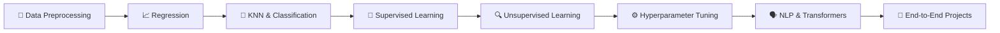

<!-- Animated banner / typing intro -->

 

---

## 💫 About Me

🎓 **Applied Data Science & Artificial Intelligence** student at **SRH University Heidelberg**
🧠 Passionate about turning **data into decisions** through ML, AI and clean software
🌍 Based in Germany 🇩🇪 — open to **Working Student / Internship opportunities**

> *"I don't just learn algorithms — I build, break and document them until they make sense."*

🔭 **Currently working on:** an **AI Content Generator** — a multimodal Collaborative Industry Project at SRH Heidelberg that generates marketing-ready content (text + visuals) from short prompts.
📚 **Also growing:** [ML Practice](https://github.com/Nihalpujari/ML_Practice) — a hands-on lab covering the full ML workflow, from preprocessing to transformers.

---

## 🛤️ My Learning Journey

| Stage | What I learned | Where to see it |
|------:|---------------|-----------------|
| 1 | Data cleaning, encoding, scaling | [`data preprocessing/`](https://github.com/Nihalpujari/ML_Practice/tree/main/data%20preprocessing) |
| 2 | Linear, Ridge, Lasso, Logistic regression | [`basic regression/`](https://github.com/Nihalpujari/ML_Practice/tree/main/basic%20regression) |
| 3 | K-Nearest Neighbors + decision boundaries | [`basic knn/`](https://github.com/Nihalpujari/ML_Practice/tree/main/basic%20knn) |
| 4 | Trees, Random Forest, SVM, Gradient Boosting | [`supervised/`](https://github.com/Nihalpujari/ML_Practice/tree/main/supervised) |
| 5 | K-Means, PCA, Penguin clustering project | [`Unsupervised/`](https://github.com/Nihalpujari/ML_Practice/tree/main/Unsupervised) |
| 6 | GridSearchCV, RandomizedSearchCV, Pipelines | [`Hyperparameter tuning/`](https://github.com/Nihalpujari/ML_Practice/tree/main/Hyperparameter%20tuning) |
| 7 | NLTK → spaCy → GloVe → Word2Vec → Transformers | [`NLP/`](https://github.com/Nihalpujari/ML_Practice/tree/main/NLP) |
| 8 | Real-world end-to-end projects | [`Titanic/`](https://github.com/Nihalpujari/ML_Practice/tree/main/Titanic) · [`real data/`](https://github.com/Nihalpujari/ML_Practice/tree/main/real%20data) |

---

## 🌱 Currently Learning

- 🤗 **Transformers & Hugging Face** — sentiment, zero-shot, QNLI pipelines
- 🧠 **RNNs, LSTMs, Word2Vec** — building sequence models from scratch in Keras
- 🎨 **Multimodal AI** — combining text + image generation (via my Industry Project)
- 🐳 **MLOps basics** — Docker, model deployment, AWS / GCP
- 🧪 **Experiment tracking** — MLflow, Weights & Biases

---

## 💻 Tech Stack

### 👨‍💻 Languages

### 📊 Data Science & ML

### 🗄️ Databases & Backend

### ☁️ Cloud & Deployment

### 🛠️ Tools

### 🎮 Just for fun

---

## 📊 GitHub Stats

 

---

## ✍️ Dev Quote of the Day

---

## 📫 Let's Connect

I'm always open to **collaborations, internship offers, and conversations about ML / AI**. Reach out!

⭐ *If you like my work, drop a star on my repos — it really helps!* ⭐

